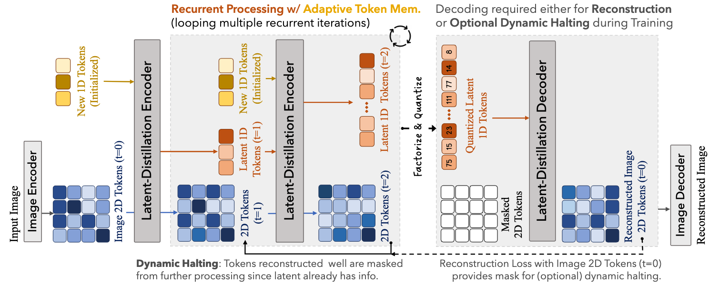
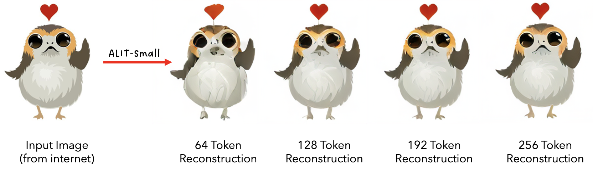

# Adaptive Length Image Tokenization (ALIT)

This is the code repository of the paper: 

> [Adaptive Length Image Tokenization via Recurrent Allocation](https://arxiv.org/abs/2411.02393)  
> [Shivam Duggal](https://shivamduggal4.github.io/), [Phillip Isola](https://web.mit.edu/phillipi/), [Antonio Torralba](https://groups.csail.mit.edu/vision/torralbalab/), [William T. Freeman](https://billf.mit.edu/)  
> MIT CSAIL

## Table of Content
[Abstract](#Abstract)  
[Approach Overview](#Overview)  
[Setup](#Setup)  
[Datasets](#Datasets)  
[Pretrained Checkpoints](#PretrainedCheckpoints)  
[Training](#Training)  
[Evaluation](#Evaluation)  
[Citation](#Citation)  

<a name="Abstract"></a>
## Abstract

<div style="text-align: justify;">
Current vision systems typically assign fixed-length representations to images,
regardless of their information content. This contrasts with human intelligence — and even large language models — which allocate varying representational capacities based on entropy, context, and familiarity. Inspired by this, we propose an approach to learn variable-length token representations for 2D images. Our encoder-decoder architecture recursively processes 2D image tokens, distilling them into 1D latent tokens over multiple iterations of recurrent rollouts. Each iteration refines the 2D tokens, updates the existing 1D latent tokens, and adaptively increases representational capacity by adding new tokens. This enables the compression of images into a variable number of tokens, ranging from 32 to 256. We validate our tokenizer using reconstruction loss and FID metrics, demonstrating that token counts align with image entropy, familiarity, and downstream task requirements. The recurrent token processing with increasing representational capacity in each iteration shows signs of token specialization, revealing the potential for object and part discovery.
</div>

<a name="Overview"></a>
## Approach Overview



<a name="Setup"></a>
## Setup

#### Environment Setup
```bash
mamba env create -f environment.yaml
mamba activate adaptive_representations
```
 

#### Training Setup
Training the adaptive tokenizer requires pretrained checkpoints of the base 2D image tokenizers. We use VQGAN or VAE as the base tokenizers. We acknowldege [Mage](https://github.com/LTH14/mage) / [Mar](https://github.com/LTH14/mar) for releasing Imagenet-trained checkpoints of VQGAN / VAE.  Run the following to **download the pretrained base tokenizers** at `base_tokenizers/pretrained_models`

```bash
python base_tokenizers/pretrained_models/download.py
```

To use a custom base tokenizer, add the tokenizer code in [`base_tokenizers`](base_tokenizers/), corresponding pretrained checkpoint in [`base_tokenizers/pretrained_models`](base_tokenizers/pretrained_models) and a wrapper in [`modules/base_tokenizers.py`](modules/base_tokenizers.py). See `VQGANWrapper` or `LDMVAEWrapper` for reference.


<a name="Datasets"></a>
## Datasets

We mainly used ImageNet and ImageNet100 (subset of ImageNet) for training. Download [ImageNet](https://image-net.org/download) dataset and place it in  $IMAGENET_DIR. To create the ImageNet100 sybset, run the following:

```bash
python run_scripts/create_imagenet100.py --imagenet_dir $IMAGENET_DIR --imagenet100_dir datasets/imagenet100/  
set -x IMAGENET100_DIR datasets/imagenet100/
```

We also evaluated ALIT on COCO val2017, NYUv2, Wikipedia Image-Text (WIT) datasets.

<a name="PretrainedCheckpoints"></a>
## Pretrained Checkpoints

Download the required checkpoint and place it at `adaptive_tokenizers/pretrained_models/imagenet100/`. Optinally run the following to download all the models:

```bash
python adaptive_tokenizers/pretrained_models/download.py
```


Figure 9. of the paper clearly shows the power of scaling the adaptive tokenizer to larger model sizes, longer training and larger datasets. Due to compute resources in an academic setting, we are not able to do that. **Please feel free to reach out if you're interested in scaling up the approach and we would be happy to help!**

| Adaptive Tokenizer | Base Tokenizer | Dataset | Latent Quantization | Latent Factorization | Pretrained Checkpoint |
|--------------------|----------------|----------------|----------------------|----------------------|----------------------|
| alit_small         | vqgan          |  ImageNet100          | $\checkmark$         | $\checkmark$         | [Download Link](https://www.dropbox.com/scl/fi/iszluhiop09z3afo2gw5f/alit_small_vqgan_quantized_latents.pth?rlkey=klt0zgeunb60l1snuzhjdzdq2&st=zgwzgc2r&dl=0)
| alit_base         | vqgan          |  ImageNet100          |  $\checkmark$         | $\checkmark$         | [Download Link](https://www.dropbox.com/scl/fi/6cygifz37knpqtkxgfj81/alit_base_vqgan_quantized_latents.pth?rlkey=r8hn0d4d8j8eg2wjorzl9c67s&st=c5iv7wor&dl=0)
| alit_semilarge         | vqgan          |  ImageNet100          |  $\checkmark$         | $\checkmark$         | [Download Link](https://www.dropbox.com/scl/fi/wcp7s6w86slh1yy4m3egc/alit_semilarge_vqgan_quantized_latents.pth?rlkey=cf2s13c6ah3ru4ly9tb911gi7&st=d11uoq0i&dl=0)
| alit_small        | vqgan          |  ImageNet100          |  $\times$         | $\checkmark$         | [Download Link](https://www.dropbox.com/scl/fi/twbxjch2hutxjsy3sd85y/alit_small_vqgan_continuous_latents.pth?rlkey=68ycbjp6upkrxt22w5rm58cjv&st=5nyk6uvu&dl=0)
| alit_small         | vae          |  ImageNet100          |  $\checkmark$         | $\checkmark$         | [Download Link](https://www.dropbox.com/scl/fi/svykasoyyoapfzlghjuz2/alit_small_vae_quantized_latents.pth?rlkey=dtvyj74zq593zc7c63miwkhs3&st=dwm9w2sp&dl=0)
| alit_small         | vae          |  ImageNet100          |  $\times$         | $\checkmark$         | [Download Link](https://www.dropbox.com/scl/fi/bq2yzr7dufvrpnycb856b/alit_small_vae_continuous_latents.pth?rlkey=hjx6jpr6vvfzhtgkp1cc1rnrs&st=4aa1vyh9&dl=0)


## Training

ALIT is trained in two stages – `latent distillation pretrain` and `full finetuning (with gan loss)`.

#### Latent Distillation Pretrain

We train the latent-distillation encoder / decoder modules in this stage, keeping image encoder / decoder fixed.

```bash
set -x TRAIN_DATA_DIR $IMAGENET100_DIR # Set to $IMAGENET_DIR or some other dataset to change the training dataset.
bash run_scripts/latent_distillation_pretrain.sh
```
Reference guide for adaptive tokenizer arguments:  
- `--base_tokenizer` selects 2D Image Tokenizer, current options include vqgan or vae.  
- `--model` selects the adaptive tokenizer configurations. Options: `alit_tiny | alit_small | alit_base | alit_semilarge`.  Note: our semilarge is smaller than usual ViT large with 24 layers.  
- `--quantize_latent` leads to quantization of the learned 1D tokens before decoding (this helps create compressed image representations).  
- `--factorize_latent` performs feature dimension factorization of the learned 1D tokens before quantization. If `--quantize_latent` is set True, `--factorize_latent` will be set True automatically.  
- For rest of the arguments, please refer (and directly edit) the config files at `adaptive_tokenizers/configs/adaptive_vqgan.yaml` and `adaptive_tokenizers/configs/adaptive_vae.yaml`.  
- See `--output_dir` for training logs and checkpoints.  


#### Full Finetuning Pretrain

Performs full finetuning of the latent-distillation encoder / decoder and image encoder / decoder with gan losses.  

```bash
bash run_scripts/full_finetuning.sh
```

- `--finetune` loads the checkpoint trained in the previous stage (set the argument to the corresponding path accordingly).  
- See `--output_dir` for training logs and checkpoints.

## Evaluation

#### Evaluating the training model on the validation subset

The following command will load your trained model checkpoint for `alit_small` with `vqgan` base tokenizer and `quantize_latent=True`.

```bash
python evaluate_rfid.py \
    --model alit_small \
    --base_tokenizer vqgan \
    --quantize_latent \
    --output_dir ./output_dir/full_finetuning/alit_small_vqgan_quantized_latents/ \
    --ckpt ./output_dir/full_finetuning/alit_small_vqgan_quantized_latents/checkpoint-last.pth \
    --data_path $TRAIN_DATA_DIR
```

To evaluate on any other custom dataset, different from the training set, simply change the – data_path to your `$CUSTOM_DATA_DIR`. The [code](evaluate_rfid.py) requires the `$CUSTOM_DATA_DIR` to have a `val` folder containing the images to be evaluated.  

#### Evaluating ALIT on custom images using pre-trained checkpoints
Create a folder with arbitrary name at `assets/custom_images/` and place the custom images inside it. See `assets/custom_images/birds` for reference.

```bash
python evaluate_rfid.py \
    --model alit_small \
    --base_tokenizer vae \
    --output_dir ./output_dir/custom_images/alit_small_vae_continuous_latents/ \
    --ckpt adaptive_tokenizers/pretrained_models/imagenet100/alit_small_vae_continuous_latents.pth \
    --data_path ./assets/custom_images/ \
    --testing_custom_images
```
<br/>



If you can support compute resources for scaling Adaptive Tokenizers on larger datasets, bigger model sizes, extended training periods, or Video ALITs, please reach out! We are very exicted by this direction.

#### Sampling Minimum Length Image Encoding

To sample minimum-length encoding for the input image – <br> (We currently support only "Reconstruction Loss < Threshold" as an **Automatic Token Selection Criteria**.)
```python
min_length_embedding, _ = adaptive_tokenizer.encode(image_tensor, return_min_length_embedding=True) # default threshold=0.07 for reconstruction loss
```

To sample all encodings for the input image –
```python
all_length_embeddings, _, _ = adaptive_tokenizer.encode(image_tensor, return_min_length_embedding=False)
```
See `adaptive_tokenizer_demo.ipynb` for more details.

## Citation

If you use our code or the paper, please consider citing the following:

```
@article{duggal2024adaptivetokenizer,
author = {Shivam Duggal and Phillip Isola and Antonio Torralba and William T. Freeman},
title = {Adaptive Length Image Tokenization via Recurrent Allocation},
journal= {arxiv},
year = {2024}
}
```
